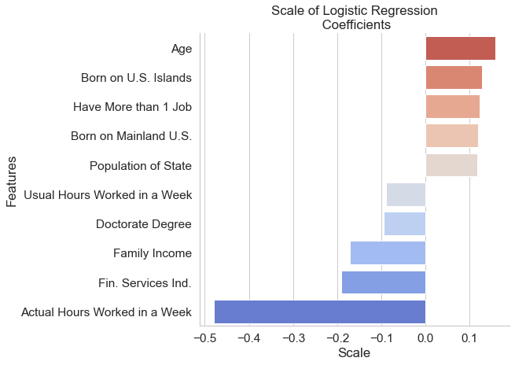

# Factors in Unemployment During Coronavirus Pandemic

**Authors**: [Tim Hintz](mailto:tjhintz@gmail.com), [Dan Valenzuela](mailto:danvalen1@gmail.com)


## Overview

In late 2019, the world was hit by the Sars-Covid-2. To prevent the spread of the disease, US state governments locked down the economy in March 2020. As a result of the pandemic, millions of people lost their jobs. The current research seeks to identify early signs that US households may lose their employment and in turn aid in the allocation of resources before the need is dire.

## Business Problem

In order to allocate resources effectively, we need to understand which features are most important in determining unemployment during a time of financial crisis. Once we understand which features are important, we can primarily monitor areas with the highest probability of showing employment loss, saving time and money. 


## Data

The demographic data used in this study comes from the `Current Population Survey` (CPS) conducted by `The United States Census Bureau`. The CPS tracks upwards of 60,000 households accross the US using multistaged stratified statistical sampling. Each house hold is followed for four months at a time. We therefore subsetted the survey for heads of household that were employed in April 2020 but had lost their jobs by July 2020.

In addition, we collected data from:
- Covid data from [New York Times](https://github.com/nytimes/covid-19-data)
- Cartographic data from [Census Bureau Cartographic Data](https://www.census.gov/geographies/mapping-files/time-series/geo/carto-boundary-file.html)
- Population data from [Census Bureau Population Data](https://www.census.gov/data/tables/time-series/demo/popest/2010s-state-total.html#par_textimage)

Data was cleaned and processed using the function outlined in `src/modules/cleaning.py` as well as in `notebooks/tjh/EDA.ipynb`

## Methodology

Due to the nature of our business problem, we opted for Logisic Regression and focused on recall/sensitivity. We wanted to know the relative importance of features as well as the sign. Since a false negativie would mean ignoring someone who lost their job we optimized for recall.

To handle the 14:1 class imbalance, we allowed Scikit-learn's Logisitc Regression to scale the classes by their inverse frequencies. 

To aid in interpretability, we used a standard scalar on our data set to convert all of the features into Z scores. 

Finally, we used l1 regularization as built in feature selection so that we only looked at our most impactful features.

We looked at the top 10 most impactful features, 5 with a negative sign and 5 with a positive sign and graphed the results.

## Results

The older you are, the more likely you are to be unemployed and those people who have jobs that demand long working hours are the most likely to keep their jobs. Interestingly, those people who had two or more jobs were more likely to not be employed after the pandemic hit indicating that hours worked alone is not the whole picture.




## Conclusion

We recommend monitoring closely communities based on the metrics described in our research in order to quickly allocate funds and support where it is likely to be needed most.

## Repository Structure

```
├── README.md                           <- The top-level README for reviewers of this project
├── Project_Walkthrough.ipynb           <- Narrative documentation of analysis in Jupyter notebook
├── Factors in Unemployment.pdf         <- PDF version of project presentation
├── src                                 <- Contains images, data, and modules
│   ├── images                          <- Images created and downloaded
│   ├── data                            <- Source data used
│   └── modules                         <- .py files
├── images                              <- Both sourced externally and generated from 
│                                          code
├── notebooks                           <- Noteboooks used to build Walkthrough
└── data                                <- Data obtained from the Census Bureau
```


